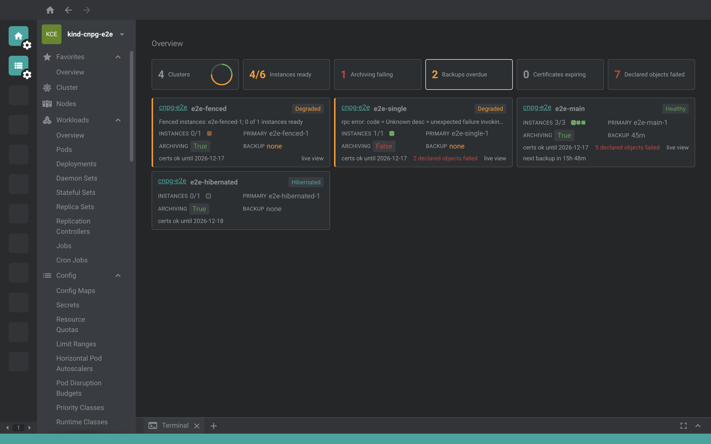
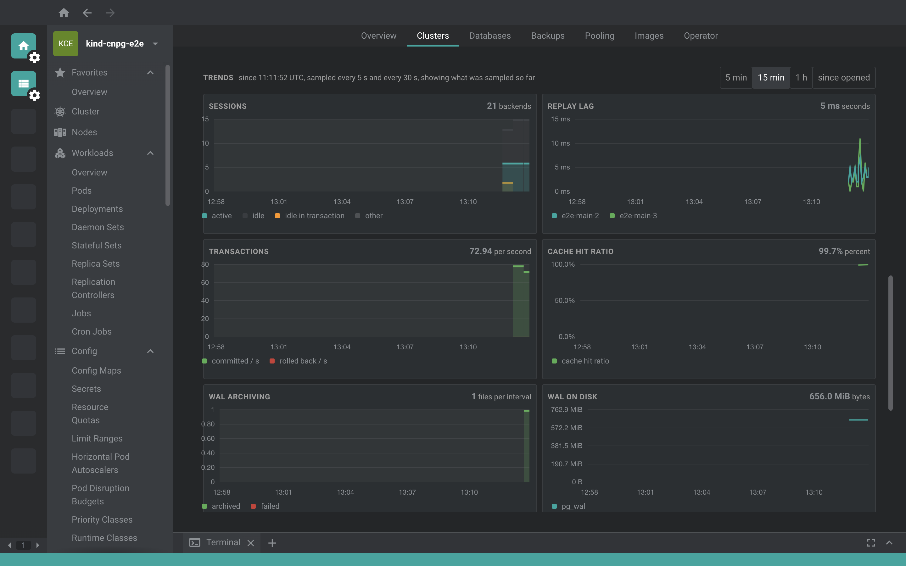
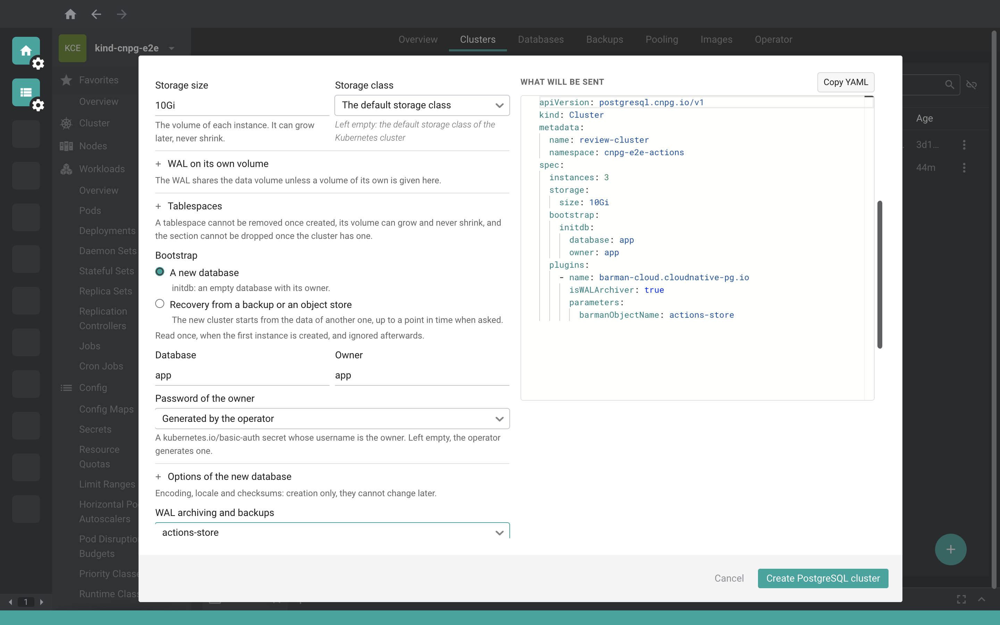

# @freelensapp/cnpg-extension

<!-- markdownlint-disable MD013 -->

[](https://freelens.app)
[](https://github.com/freelensapp/freelens-cnpg-extension)
[](https://deepwiki.com/freelensapp/freelens-cnpg-extension)
[](https://github.com/freelensapp/freelens-cnpg-extension/releases)
[](https://github.com/freelensapp/freelens-cnpg-extension/actions/workflows/unit-tests.yaml)
[](https://github.com/freelensapp/freelens-cnpg-extension/actions/workflows/integration-tests.yaml)
[](https://github.com/freelensapp/freelens-cnpg-extension/actions/workflows/e2e-tests.yaml)
[](https://www.npmjs.com/package/@freelensapp/cnpg-extension)

<!-- markdownlint-enable MD013 -->

## Overview

[Freelens](https://freelens.app) extension for
[CloudNativePG](https://cloudnative-pg.io), the Kubernetes operator for
PostgreSQL: every PostgreSQL cluster the operator manages, from the Kubernetes
resources down to what happens inside the databases right now, inside the
Freelens desktop application and across every cluster it connects to.

The extension lives in the cluster sidebar under **CloudNativePG**:
**Overview**, **Clusters** (with the **Live View**, the **Logs** and the
**Timeline** of a cluster, and the **Failover Quorums**), **Databases**
(databases, roles, publications and subscriptions), **Backups** (backups,
scheduled backups and object stores), **Pooling**, **Images** and
**Operator**. Everything reads through the Freelens session that is already
authenticated to the Kubernetes cluster. The write actions (backups,
switchover, restart, reload, fencing, hibernation, the schedules) and the
creation forms write only after a dialog has listed the exact API calls, and
no database credential is ever read, stored or asked for.







The goal is the most complete and usable graphical interface for
CloudNativePG. The extension is a from-scratch MIT implementation: it does
not reuse code or UI from any other CloudNativePG interface, graphical or
command line, which are functional references only. CloudNativePG is a
trademark of the Linux Foundation; this extension is not a CloudNativePG
product.

### Status

> **Feature complete for v1.0.0: every milestone of the roadmap, M1 to M7,
> is implemented and verified.** The repository is developed spec-first: one
> spec per feature under [docs/specs](docs/specs/), each one implemented
> behind an approved spec and verified by unit tests, by an E2E suite that
> drives the packaged extension in the real Freelens against a kind cluster
> with the real operator, and by an agent pass that walks every view on both
> themes before the review of the lead maintainer. See the
> [roadmap](docs/development/ROADMAP.md).

## Requirements

- **Freelens >= 1.10.3.** Verified on Freelens 1.10.3, the version the
  integration and E2E tests run against.
- **A Kubernetes cluster with the CloudNativePG operator.** The reviewed
  operator version is 1.30.0, the API is `postgresql.cnpg.io/v1`.
- **Optional:** the Barman Cloud plugin (reviewed at v0.15.0) for object
  stores, WAL archiving and backups through the plugin; the VolumeSnapshot
  CRDs and a CSI driver with snapshot support for backups taken as volume
  snapshots.
- **Kubernetes access** through the kubeconfig context Freelens uses for the
  cluster. The lists and drawers need `list` and `watch` on the
  CloudNativePG kinds; the Live View, the live figures of the poolers and
  the metrics of the operator need `get` on `pods/proxy`; the Logs need
  `get` on `pods/log`; Open psql needs `create` on `pods/exec`; every write
  action and form needs the verb it performs on the kind it touches, and
  the switchover also `patch` on `clusters/status`. An action the account
  may not perform is disabled with the reason.
- **Node.js** is required only when building the extension from source; it
  is not needed to run it. The package is a self-contained bundle: its
  runtime libraries are compiled into `out/`, so Freelens loads it without
  installing anything extra.

## Supported resources

Every kind below has its list and its drawer; the kinds a person creates by
hand have a creation form too, and the write actions are on the row menus and
in the drawers (see the [roadmap](docs/development/ROADMAP.md)).

### postgresql.cnpg.io/v1

<!-- markdownlint-disable MD013 -->

| Kind | Views |
| --- | --- |
| `Cluster` | List with the health summary, drawer (instances, replication with the primary lease, PostgreSQL, declarative objects, storage with the tablespaces, backups and archiving, certificates, services and secrets, plugins), Overview, Live View with the trends, Logs, Timeline, creation form (image, storage, tablespaces, bootstrap from a new database, a backup, an object store or the volume snapshots of a backup, WAL archiving, volume snapshot backups, replication, resources, updates, scheduling) |
| `Backup` | List and drawer with the restore coordinates and the volume snapshots |
| `ScheduledBackup` | List and drawer with the schedule in words and the backups it generated, creation form |
| `Pooler` | List and drawer with the live PgBouncer figures, creation form |
| `Database` | List and drawer with the managed objects and the size of the database right now, creation form |
| `DatabaseRole` | List and drawer with attributes, password and client certificate expiry, creation form |
| `Publication` | List and drawer with the published objects, the replication path and the logical slots, creation form |
| `Subscription` | List and drawer with the replication path, the slot on the publisher and the failover caveat, creation form |
| `ImageCatalog` | List and drawer with the clusters that follow it |
| `ClusterImageCatalog` | List and drawer with the clusters that follow it |
| `FailoverQuorum` | List and drawer with the failover check told in words |

### barmancloud.cnpg.io/v1

| Kind | Views |
| --- | --- |
| `ObjectStore` | List and drawer with the recovery windows, creation form (Barman Cloud plugin; the in-tree `barmanObjectStore` form is deprecated and is never generated by the extension) |

<!-- markdownlint-enable MD013 -->

## Installation

Install the extension from the Freelens **Extensions** page
(`ctrl`+`shift`+`E` or `cmd`+`shift`+`E`) by npm name:

```text
@freelensapp/cnpg-extension
```

Alternatively, open the following URL in the browser to install directly:

[freelens://app/extensions/install/%40freelensapp%2Fcnpg-extension](freelens://app/extensions/install/%40freelensapp%2Fcnpg-extension)

or download the `.tgz` from the
[GitHub releases](https://github.com/freelensapp/freelens-cnpg-extension/releases)
page and drag it into the Freelens window, or provide its path on the
Extensions page.

You can also build and pack the extension yourself, see
[Build from the source](#build-from-the-source).

## Getting started

1. Connect to a Kubernetes cluster that runs the operator. A
   **CloudNativePG** group appears in the cluster's left sidebar. Pick the
   namespaces of your PostgreSQL clusters in the namespace filter, at the
   top of the Overview and of every list: on a first connection Freelens
   selects only `default`.
2. Open **Overview**: one tile per PostgreSQL cluster, ordered by urgency,
   with counters for the instances that are not ready, the archiving that
   fails, the backups that are overdue, the certificates that expire and the
   declared objects the databases do not have. Every figure leads to the
   list or the drawer behind it.
3. Open **Clusters** and a cluster: its drawer tells the whole story
   (instances and roles, replication, storage and tablespaces, backups and
   archiving, certificates, declared objects, plugins, the related pods,
   volumes, services and secrets). The row menu holds **Open psql**,
   **Back up now**, **Switchover**, **Restart**, **Reload**, **Fence** and
   **Hibernate**.
4. Open **Live View** and pick a cluster: replication topology and lag,
   sessions, database sizes, WAL and archiving, replication slots, and the
   trends since the page opened, read from the instances through the API
   server.
5. Press the **+** button of a list to create an object: the right pane of
   the form is the exact YAML the create sends.
6. No cluster at hand? `pnpm demo:up` builds one on your machine, see
   [Demo environment](#demo-environment-docker--kind).

> **Safety:** everything reads until you confirm a dialog that names the
> PostgreSQL cluster and the Kubernetes context and lists the exact API
> calls it makes. The extension runs no SQL of its own beyond fixed
> read-only queries on the instances, never stores a credential, and never
> generates a deprecated form of the operator's API. Open psql connects as
> the `postgres` superuser, see [Open psql](#open-psql).

## Features

### Overview and clusters

The **Overview** shows the health of every PostgreSQL cluster at a glance.
The **PostgreSQL Clusters** list carries a health summary (ready instances,
primary, WAL archiving, last successful backup); the drawer of a cluster
tells its whole story: instances and roles, replication with the primary
lease and the synchronous settings, storage with the tablespaces and their
state, certificates with their expiry, conditions, backups with the history
strip, the declared databases and roles, plugins, and the related pods,
volumes, services and secrets. **Failover Quorums** say, for clusters with
quorum based failover, whether a failover could be decided safely right now,
with the check told in words.

### Backups, archiving and object stores

**Backups** and **Scheduled Backups** with the outcome of every backup and
its reason, the coordinates needed to restore from it, the volume snapshots
it took, the schedule as written and in words, and a backup history strip
that shows at a glance how a cluster has been protected over time. **Object
Stores** of the Barman Cloud plugin: where backups and WAL go, which
clusters write there, and the recovery window the plugin itself reports for
each of them.

### Live View, Logs and Timeline

The **Live View** shows what happens inside a cluster right now (replication
topology and lag, sessions, database sizes, WAL and archiving, replication
slots) and nine trend cards drawn since the page opened (sessions by state,
replay lag per standby, transactions per second, cache hit ratio, WAL
archived and failed, WAL on disk, database sizes, checkpoints, deadlocks and
temporary files), read from the instances through the API server pod proxy
with nothing installed beyond the operator. The **Logs** page renders the
JSON lines of the instances as rows you can read (who said it, how serious
it is, the message, and for PostgreSQL the user, the database and the
query), every instance of a cluster on one time axis, followed live. The
**Timeline** puts the Kubernetes events of a cluster and of everything it
owns next to the facts that outlive them (backups, the change of primary,
the conditions) and to what is scheduled to come.

### Pooling, images and the operator

**Poolers**: every PgBouncer pooler, what it fronts, and in its drawer what
it is doing right now (clients, servers, clients waiting and for how long).
**Image Catalogs** and **Cluster Image Catalogs**: what each catalog offers
per major version and which clusters follow it, with the image each cluster
runs next to the image the catalog offers. **Operator**: version, replicas,
who leads, what it watches, its configuration, the reconciles per controller
right now from its own metrics, the CNPG-I plugins it found with the clusters
that loaded them, and the kinds the cluster serves.

### Declarative databases and logical replication

**Databases**: every database declared for a cluster and whether PostgreSQL
has it as declared; when it has not, which part failed and why, down to the
single extension or schema, and in the drawer the size and the sessions of
the database right now. **Database Roles**: what each role may do, how it
authenticates and until when (password expiry, client certificate expiry),
and the role of the cluster spec that wins over it when both declare the
same name; secrets are linked, never read. **Publications** and
**Subscriptions**: a logical replication read as one path, from the
publication of one cluster to the subscription of another, with the
replication slot on the publisher right now and whether the pair survives a
failover of the publisher.

### Write actions

Every action is behind a dialog that names the cluster and the Kubernetes
context, lists the exact API calls, says what happens in order and what it
costs, and is disabled with the reason where it makes no sense or where the
account may not perform it.

- **Back up now**, with the method the cluster really has (plugin or volume
  snapshot; the deprecated in-tree method is never preselected), the
  instance it will be taken from and what is ahead of it in the queue.
- **Switchover** to the standby you choose from a table of the standbys as
  they are right now (which ones can be promoted and why the others cannot,
  the sync state, the replay lag read from the primary every five seconds),
  with the name of the cluster typed to confirm; **Promote** on the row of
  a standby opens the same dialog with that standby chosen.
- **Restart** of a cluster, with the rollout in order from the cluster's own
  settings, or of one instance from its row; **Reload**, told honestly.
- **Fencing** of one instance or of all of them, with the old and the new
  value of the annotation spelled out and the warnings about the primary and
  the synchronous replication; the fence is lifted from the same rows.
- **Hibernate** and **Resume**, with everything attached to the cluster and
  what happens to it listed before the click.
- **Suspend**, **Resume** and **Run now** on a scheduled backup, with what
  the operator will do next said in the dialog.

### Creation forms

A PostgreSQL cluster, a scheduled backup, a pooler, an object store, a
database, a role, a publication and a subscription, from the **+** button of
their lists and from the drawer of a cluster. The form is the confirmation:
its right pane is the exact YAML the create sends, every rule of the
operator's admission the form can express is checked at the field, the
recommended shape is the default (backups through the Barman Cloud plugin,
no deprecated field), the values the operator stamps on its own are shown and
never sent, and the OK button says why it is disabled until the form is
complete. The cluster form covers the image, the storage, the tablespaces,
the bootstrap (a new database, a completed backup, an object store, or the
volume snapshots of a backup with the optional WAL archive of the source),
WAL archiving, backups as volume snapshots (hot or cold), replication,
resources, updates and scheduling. The scheduled backup form has a cron
editor with the next three runs; the declarative forms say the SQL the
primary will run.

### Open psql

"Open psql" writes one command into a terminal tab of Freelens, the same one
the `kubectl cnpg psql` plugin runs:
`kubectl exec -i -t -n <namespace> <pod> -c postgres -- psql -U postgres`.
It runs under your own kubeconfig, needs `kubectl` on the PATH of the
Freelens terminal and `pods/exec` on the instance pod. **The session
connects as the `postgres` superuser** over the local socket of the
instance, exactly as the upstream plugin does; on a standby it is a
read-only session. The extension itself never runs SQL in that session and
never sees a credential: it composes the command from the namespace and the
pod name, and everything after that happens in your terminal.

## Limits

- The Live View, the live figures of the poolers and the metrics of the
  operator are read through the API server pod proxy: without `get` on
  `pods/proxy` the panel says what to grant, and a cluster whose instances
  do not answer shows what the resources say and nothing more.
- Backups as volume snapshots need the VolumeSnapshot CRDs and a CSI driver
  with snapshot support in the Kubernetes cluster; a hot snapshot is
  recovered with the WAL archive of the source; the form offers recovery
  from volume snapshots, not from a bare persistent volume claim.
- The forms create; editing an existing object is the host's own YAML
  editor in the drawer. Bootstrap by streaming from another cluster
  (`pg_basebackup`), the import of databases and the fields an operator
  sets in YAML once and for all are outside the form: the YAML pane can be
  copied to finish the job by hand.
- The deprecated in-tree `barmanObjectStore` backup method is shown where it
  exists, with a badge, and never generated.
- The suites run on macOS locally and on Linux in CI; Open psql on Windows
  depends on `kubectl` being on the PATH of the Freelens terminal.

## Development

The repository is developed spec-first, with the specs in the repository:

- [PROCESS.md](docs/development/PROCESS.md): the spec-driven workflow, the
  manual verification escalation and the milestone review gate.
- [ROADMAP.md](docs/development/ROADMAP.md): scope and progress.
- [ARCHITECTURE.md](docs/development/ARCHITECTURE.md): renderer and main
  process roles, the data paths to the cluster, the licensing boundary.
- [DESIGN.md](docs/development/DESIGN.md): the binding UI directives.
- [TESTING.md](docs/development/TESTING.md): the test layers and how to run
  them.
- [TRY-IT.md](docs/development/TRY-IT.md): the demo cluster and a guided
  walk through every view.
- [docs/specs](docs/specs/): one spec per feature, SPEC-0001 being the
  recon digest every other spec builds on.

### Local gates

Node.js 24.15.0 (`.nvmrc` / `mise.toml`) and `corepack pnpm`. Run the local
gates after every change:

```sh
pnpm type:check
pnpm lint:check     # biome (lint:fix to auto-format)
pnpm build
pnpm knip:check
pnpm test:unit
```

### Demo environment (Docker + kind)

`demo:up` builds a disposable, fully populated environment on your machine,
so that anyone can try the extension or record a demo without preparing
anything by hand. It needs Docker (about 8 GB of memory for its VM), `kind`,
`kubectl` and Node.js.

```sh
pnpm demo:up      # about ten minutes the first time, seconds afterwards
pnpm demo:down    # deletes the demo cluster and its state folder
```

What you get: a dedicated kind cluster `cnpg-demo` (kubeconfig printed at
the end, never written into your own), the CloudNativePG operator 1.30 with
the Barman Cloud plugin, an in-cluster object store, a CSI driver with
snapshot support, four PostgreSQL clusters in different states (healthy with
a running load, degraded with a failing archive, hibernated, fenced), one
more cluster for the write actions and one on the snapshot storage class,
real backups, schedules, a pooler, and declared databases, roles,
publications and subscriptions, some of them failing on purpose. The
[walkthrough](docs/development/TRY-IT.md) then takes you through every view.

### E2E suite and pre-review pass

The E2E suite drives the packaged extension in a Freelens build against the
same kind cluster; the pre-review pass walks every view on both themes,
checks the rules of DESIGN.md a machine can check, and leaves the screenshots
and a report under `e2e-artifacts/`. Both need a Freelens checkout, see
[TESTING.md](docs/development/TESTING.md).

```sh
pnpm e2e:cluster:up
pnpm e2e
pnpm pre-review
pnpm e2e:cluster:down
```

## Build from the source

You can build the extension from this repository.

### Prerequisites

Use [NVM](https://github.com/nvm-sh/nvm),
[mise-en-place](https://mise.jdx.dev/), or
[windows-nvm](https://github.com/coreybutler/nvm-windows) to install the
required Node.js version.

From the root of this repository:

```sh
nvm install
# or
mise install
# or
winget install CoreyButler.NVMforWindows
nvm install 24.15.0
nvm use 24.15.0
```

Install pnpm:

```sh
corepack install
# or
curl -fsSL https://get.pnpm.io/install.sh | sh -
# or
winget install pnpm.pnpm
```

### Build extension

```sh
pnpm i
pnpm build
pnpm pack
```

One script to build and pack the extension for testing:

```sh
pnpm pack:dev
```

This bumps a throwaway prerelease version, builds, and writes a
`freelensapp-cnpg-extension-*.tgz` into the repo root. The version bump
makes Freelens treat each rebuild as an upgrade, so re-installing actually
reloads your changes.

### Install built extension

The tarball will be placed in the current directory. In Freelens, navigate
to the Extensions page (`ctrl`+`shift`+`E` or `cmd`+`shift`+`E`) and provide
the path to the tarball, or drag and drop the `.tgz` file into the Freelens
window. Enable it if prompted.

### Check code statically

```sh
pnpm lint:check
```

or

```sh
pnpm trunk:check
```

and

```sh
pnpm build
pnpm knip:check
```

### Testing the extension with unpublished Freelens

In the Freelens working repository:

```sh
rm -f *.tgz
pnpm i
pnpm build
pnpm pack -r
```

Then in the extension repository:

```sh
echo "overrides:" >> pnpm-workspace.yaml
for i in ../freelens/*.tgz; do
  name=$(tar zxOf $i package/package.json | yq -r .name)
  echo "  \"$name\": $i" >> pnpm-workspace.yaml
done

pnpm clean:node_modules
pnpm build
```

## License

Copyright (c) 2025-2026 Freelens Authors.

[MIT License](https://opensource.org/licenses/MIT)
