# M5 milestone review, 2026-09-19

Screenshot del pre-review pass sul codice finale della M5 (66 controlli automatici passati, vedi [REPORT.md](REPORT.md)).
Per ogni vista: tema scuro, poi tema chiaro. Branch usa e getta: si cancella dopo la review.

## logs

Logs: le righe JSON delle istanze diventano righe leggibili, tutte le istanze del cluster su un solo asse temporale. Qui un errore PostgreSQL con utente, database, query e SQL state, subito sopra l'errore dell'instance manager che ne e' la conseguenza

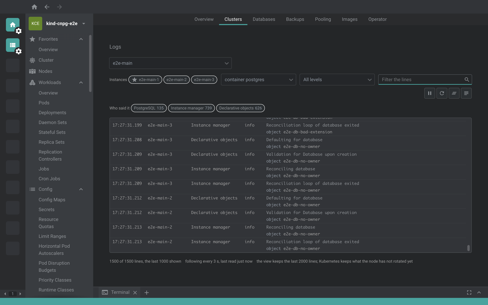

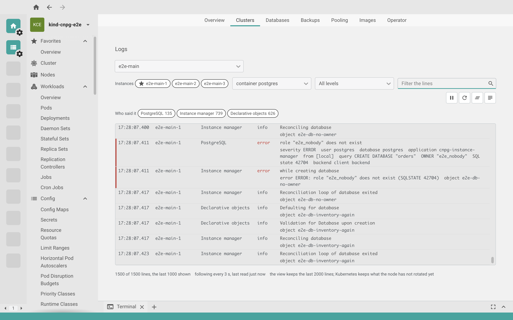

## logs-errors

Logs di e2e-single filtrati su Errors: restano solo i fallimenti del WAL archiving (solo tema scuro, dalla suite E2E)

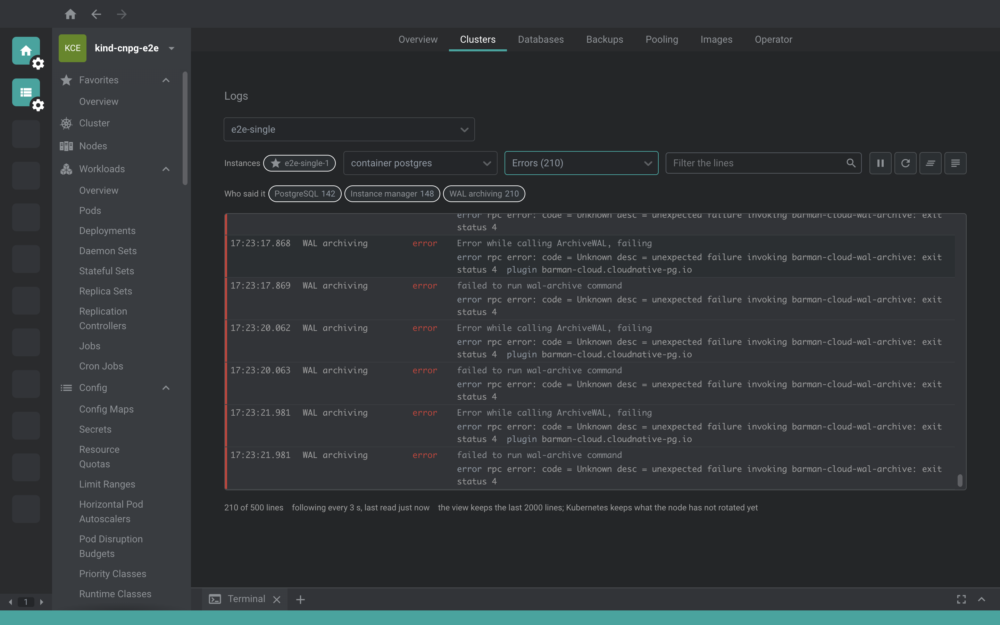

## timeline

Timeline: cosa deve ancora succedere (prossimi backup, primo certificato in scadenza) sopra il marker "now", poi eventi Kubernetes, backup, primary, lease e condizioni in ordine

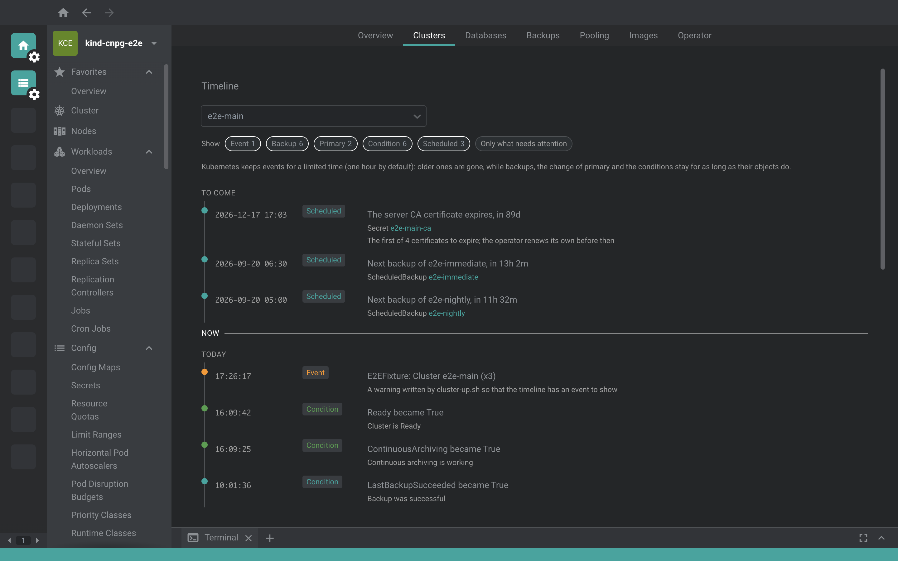

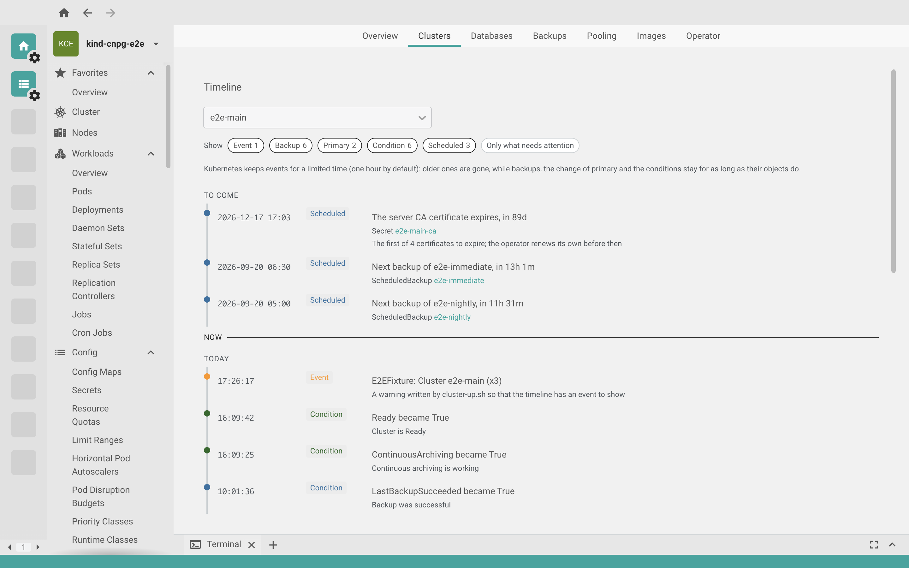

## timeline-errors

Timeline di e2e-single: il backup fallito e la condizione di archiviazione che fallisce come errori (solo tema scuro, dalla suite E2E)

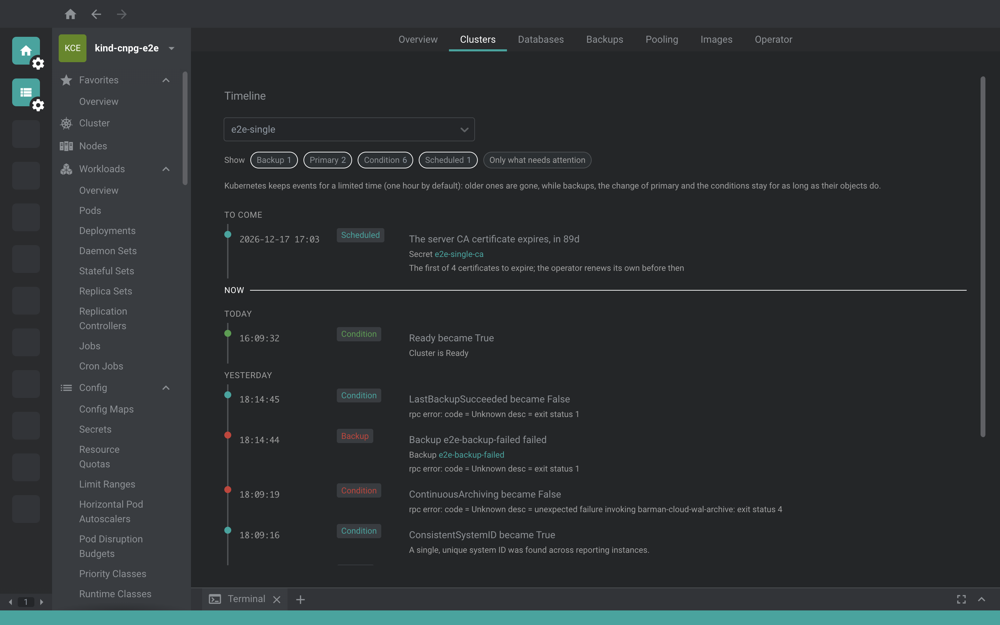

## operator

Operator: stato, versione, leader con il suo lease, cosa osserva, configurazione, e le riconciliazioni per controller lette ora dalle metriche dell'operator

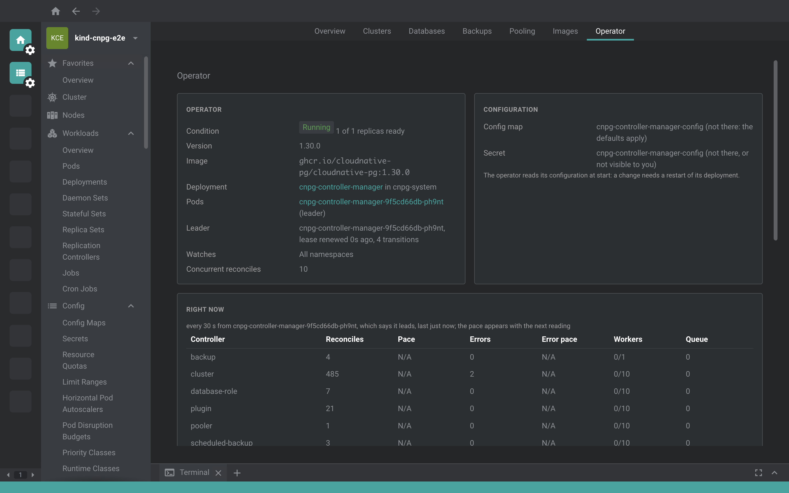

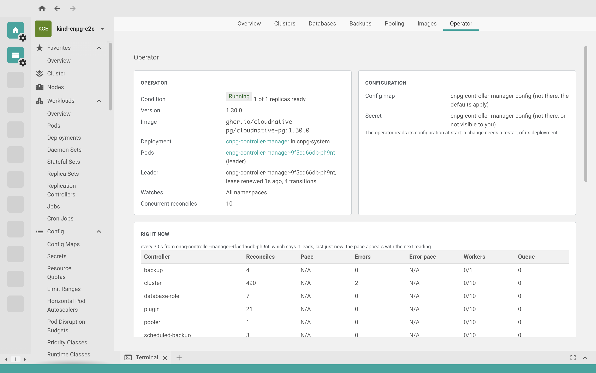

## operator-plugins-and-kinds

Operator, parte bassa: i plugin CNPG-I trovati con i cluster che li hanno caricati, e i kind serviti dal cluster con la vista corrispondente

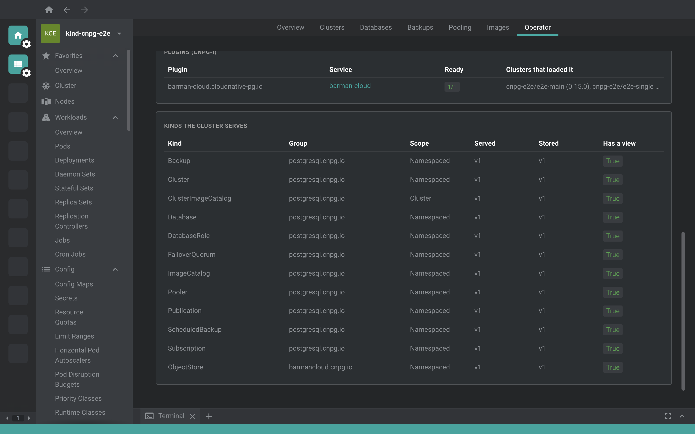

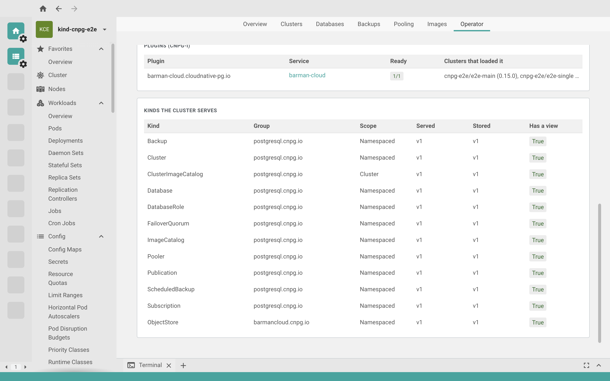

## cluster-drawer-lease

Drawer del Cluster, sezione Replication: il lease del primary (chi lo tiene, da quando, ultimo rinnovo, transizioni) e cosa significano i suoi tempi per un failover. Nella tabella Instances sopra: lo stato fenced ora sta nel badge Health e c'e' la porta ai log di ogni istanza

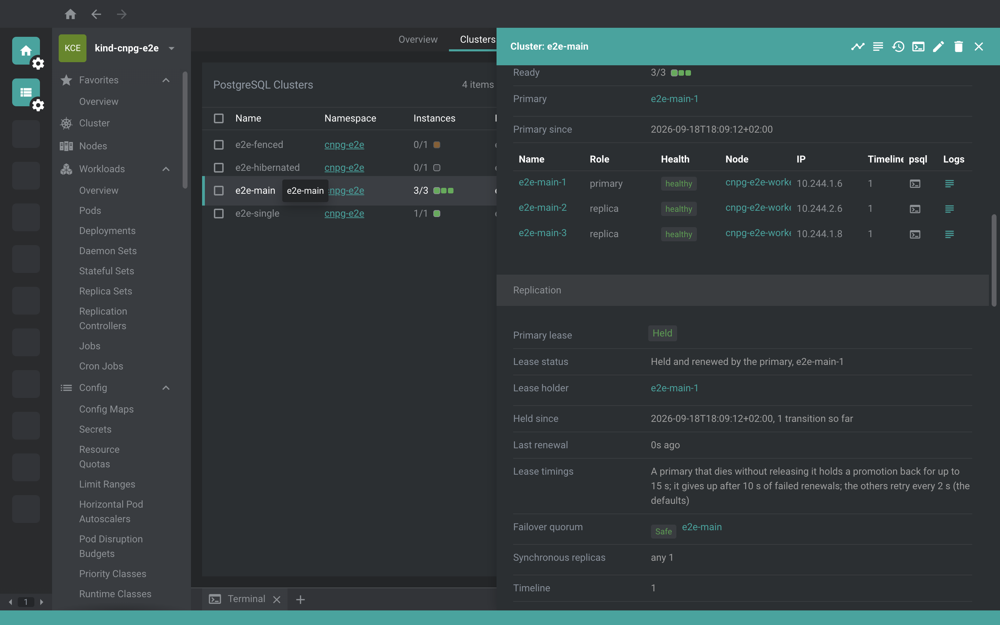

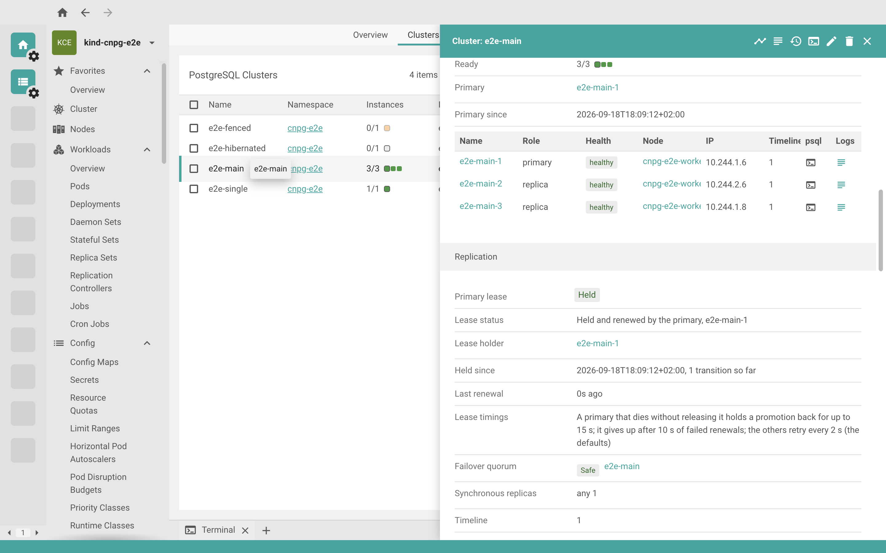
